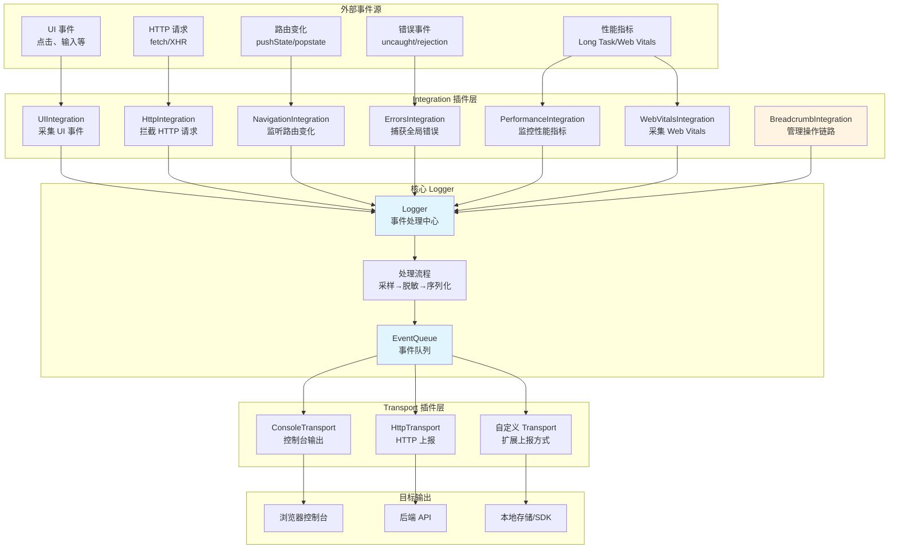
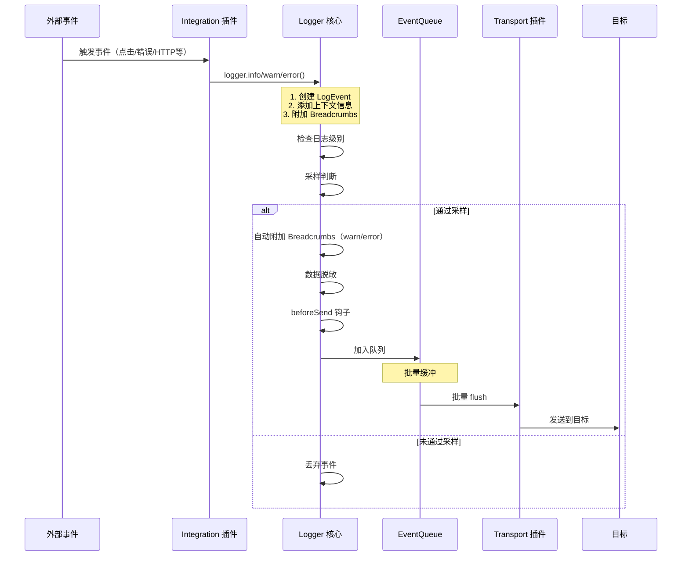

# Traceway Logger

前端日志库 - 错误追踪、用户操作链路、性能监控

## ✨ 核心特性

### 🔌 插件化架构（核心设计）

Traceway Logger 采用**完全插件化的架构设计**，这是本库的核心特性。所有功能都通过插件（Integration 和 Transport）实现，让你可以根据实际需求灵活组合和使用。

- **Integration 插件**（数据采集侧）：负责监听外部事件（UI 交互、HTTP 请求、路由变化、性能指标等），并转换为日志事件或操作链路（Breadcrumb）。你可以按需启用不同的 Integration 插件，例如只启用错误捕获，或同时启用所有监控功能。
- **Transport 插件**（数据投递侧）：负责将处理好的日志事件发送到不同的目标（HTTP 接口、控制台、本地存储等）。你可以同时使用多个 Transport，例如开发环境同时输出到控制台和远程服务器。

**插件化的优势：**
- ✅ **按需加载**：只引入和使用需要的功能，减少包体积
- ✅ **灵活扩展**：轻松创建自定义插件，满足特定业务需求
- ✅ **组合使用**：多个插件可以自由组合，实现复杂的监控方案
- ✅ **易于维护**：插件之间相互独立，互不干扰

详见[插件化架构](#插件化架构)章节。

### 🛡️ 错误自动捕获

通过 `ErrorsIntegration` 插件自动捕获全局未处理的错误和 Promise 拒绝，自动规范化错误信息（包括错误堆栈、行列号、来源文件等），并自动附加错误发生前的用户操作链路（Breadcrumb），帮助快速定位问题。

### 🍞 用户操作链路（Breadcrumb）

通过 `BreadcrumbIntegration` 插件维护用户操作链路记录。当错误发生时，自动将错误发生前的关键操作（点击、路由变化、HTTP 请求等）作为上下文信息附加到错误事件中，让你能够完整还原用户的操作路径。

### ⚡ 性能监控

- **Long Task 检测**：通过 `PerformanceIntegration` 插件监控主线程的长时间任务，检测 UI 卡顿和假死
- **Web Vitals 集成**：通过 `WebVitalsIntegration` 插件监控 Core Web Vitals（LCP、CLS、INP），并在指标超标时自动上报

### 🔒 默认脱敏

自动脱敏敏感信息（token、密码、手机号、邮箱、身份证号等），保护用户隐私。支持自定义脱敏字段和正则模式。

### 📊 采样控制

支持灵活的采样率配置，减少上报量。可以为普通事件和错误事件分别设置采样率，确保重要错误不遗漏。

### 📦 批量上报

使用缓冲队列批量上报日志，减少网络请求。支持定时 flush 和页面卸载时强制 flush，确保日志不丢失。

### 🌐 SSR 兼容

服务端渲染环境下自动安全降级，不会因为缺少浏览器 API 而报错。


## 快速开始

### 安装

```bash
npm install @traceway/logger
```

### 基础使用

```typescript
import { createLogger, ConsoleTransport, HttpTransport } from '@traceway/logger';

const logger = createLogger({
  app: 'my-app',
  env: 'production',
  release: '1.0.0',
  transports: [
    new ConsoleTransport(), // 开发环境
    new HttpTransport({
      url: 'https://api.example.com/logs',
    }),
  ],
});

// 记录日志
logger.info('user_login', 'User logged in', { userId: '123' });
logger.error('api_error', 'API request failed', { endpoint: '/api/users' });
```

### 启用集成

```typescript
import {
  createLogger,
  ConsoleTransport,
  HttpTransport,
  BreadcrumbIntegration,
  ErrorsIntegration,
  UIIntegration,
  NavigationIntegration,
  HttpIntegration,
  PerformanceIntegration,
  WebVitalsIntegration,
} from '@traceway/logger';

const logger = createLogger({
  app: 'my-app',
  env: 'production',
  release: '1.0.0',
  transports: [
    new HttpTransport({
      url: 'https://api.example.com/logs',
    }),
  ],
  integrations: [
    new BreadcrumbIntegration({ maxBreadcrumbs: 50 }),
    new ErrorsIntegration(), // 全局错误捕获
    new UIIntegration(), // 点击事件
    new NavigationIntegration(), // 路由变化
    new HttpIntegration(), // HTTP 请求
    new PerformanceIntegration(), // Long Task 监控
    new WebVitalsIntegration({ inpThreshold: 200 }), // Web Vitals
  ],
});
```

> 💡 **想要了解更多？** 
> - 查看 [插件化示例](../examples/plugins/README.md)，了解如何创建和使用自定义 Integration 和 Transport 插件
> - **TypeScript 版本**: [examples/plugins/index.html](../examples/plugins/index.html)
> - **JavaScript 版本**: [examples/plugins/example-js.html](../examples/plugins/example-js.html) (纯 JS，无需 TypeScript)

## Integration 插件详解

所有内置的 Integration 插件详细说明：

### BreadcrumbIntegration（操作链路管理）

**插件类型**：Integration 插件（核心依赖）

**功能**：维护用户操作链路（Breadcrumb）的环形队列，自动将 Breadcrumbs 附加到 `warn` 和 `error` 级别的事件中。

**配置选项**：
```typescript
interface BreadcrumbOptions {
  maxBreadcrumbs?: number; // 最大 breadcrumb 数量，默认 50
}
```

**工作原理**：
- 维护一个环形队列，存储最近的操作链路
- 其他 Integration 可以调用 `logger.addBreadcrumb()` 添加链路
- 当 `warn` 或 `error` 事件发生时，自动将最近的 Breadcrumbs 附加到事件中

**使用示例**：
```typescript
const logger = createLogger({
  integrations: [
    new BreadcrumbIntegration({ maxBreadcrumbs: 50 }), // 必须先启用
  ],
});
```

**注意事项**：
- **必须第一个启用**：如果其他 Integration 需要使用 `logger.addBreadcrumb()`，必须先启用 `BreadcrumbIntegration`
- Breadcrumb 是环形队列，超出最大数量时会自动移除最旧的记录

---

### ErrorsIntegration（全局错误捕获）

**插件类型**：Integration 插件

**功能**：自动捕获全局未处理的错误和 Promise 拒绝，并自动规范化错误信息。

**配置选项**：无

**捕获的错误类型**：
- `window.onerror` - 未捕获的 JavaScript 错误
- `window.onunhandledrejection` - 未处理的 Promise 拒绝
- 自动规范化各种错误类型（Error 对象、字符串、普通对象等）

**工作原理**：
- 拦截 `window.onerror` 和 `window.onunhandledrejection`
- 规范化错误信息（提取 name、message、stack、cause 等）
- 自动附加错误发生前的 Breadcrumbs（如果已启用 BreadcrumbIntegration）
- 记录错误详情（文件名、行号、列号等）

**错误事件字段**：
```typescript
{
  name: 'uncaught_error',
  level: 'error',
  data: {
    name: 'Error',
    message: 'Error message',
    stack: 'Error stack trace',
    source: 'script URL',
    lineno: 123,
    colno: 45,
    breadcrumbs: [...], // 错误发生前的操作链路
  },
}
```

**使用示例**：
```typescript
const logger = createLogger({
  integrations: [
    new BreadcrumbIntegration(),
    new ErrorsIntegration(), // 自动捕获全局错误
  ],
});
```

**注意事项**：
- 会保留原始的 `window.onerror` 和 `window.onunhandledrejection` 处理器（如果存在）
- SSR 环境下会自动跳过（检查 `typeof window === 'undefined'`）

---

### UIIntegration（UI 事件采集）

**插件类型**：Integration 插件

**功能**：监听用户点击事件，记录为 Breadcrumb，帮助追踪用户操作路径。

**配置选项**：
```typescript
interface UIIntegrationOptions {
  enableClick?: boolean;      // 是否启用点击事件监听，默认 true
  clickThrottleMs?: number;   // 点击事件节流间隔（毫秒），默认 1000
}
```

**工作原理**：
- 监听 `document` 的 `click` 事件（使用捕获阶段）
- 节流控制，避免过于频繁的记录
- 提取元素信息（选择器、文本、标签名等）
- 记录为 `ui` 类型的 Breadcrumb

**记录的 Breadcrumb 信息**：
```typescript
{
  type: 'ui',
  message: 'Click: #submit-btn',
  data: {
    selector: '#submit-btn',
    text: 'Submit',
    tagName: 'BUTTON',
  },
}
```

**使用示例**：
```typescript
const logger = createLogger({
  integrations: [
    new BreadcrumbIntegration(),
    new UIIntegration({
      enableClick: true,
      clickThrottleMs: 1000, // 1 秒内只记录一次点击
    }),
  ],
});
```

**注意事项**：
- 需要先启用 `BreadcrumbIntegration`
- 使用事件捕获阶段，确保能够捕获所有点击（包括动态元素）
- 会自动提取元素的选择器，优先使用 ID，其次是类名，最后是标签名

---

### NavigationIntegration（路由变化监听）

**插件类型**：Integration 插件

**功能**：监听浏览器路由变化（History API），记录为 Breadcrumb。

**配置选项**：无

**工作原理**：
- 拦截 `history.pushState` 和 `history.replaceState`
- 监听 `popstate` 事件（浏览器前进/后退）
- 记录路由变化信息（from、to、类型等）

**记录的 Breadcrumb 信息**：
```typescript
{
  type: 'nav',
  message: 'Navigation: pushState',
  data: {
    type: 'pushState', // 'pushState' | 'replaceState' | 'popstate'
    url: '/new-page',
    from: '/old-page',
    to: '/new-page',
  },
}
```

**使用示例**：
```typescript
const logger = createLogger({
  integrations: [
    new BreadcrumbIntegration(),
    new NavigationIntegration(), // 监听路由变化
  ],
});
```

**注意事项**：
- 需要先启用 `BreadcrumbIntegration`
- 会恢复原始的 `history.pushState` 和 `history.replaceState`（如果存在）

---

### HttpIntegration（HTTP 请求拦截）

**插件类型**：Integration 插件

**功能**：拦截 `fetch` 和 `XMLHttpRequest` 请求，记录请求和响应信息为 Breadcrumb。

**配置选项**：
```typescript
interface HttpIntegrationOptions {
  enableFetch?: boolean;      // 是否启用 fetch 拦截，默认 true
  enableXHR?: boolean;        // 是否启用 XHR 拦截，默认 true
  redactKeys?: string[];      // 需要脱敏的字段名列表，默认 []
}
```

**工作原理**：
- 拦截 `window.fetch` 和 `XMLHttpRequest.prototype.open/send`
- 记录请求信息（method、url、status、duration 等）
- 自动脱敏 URL 参数中的敏感信息（token、auth、key 等）
- 记录为 `http` 类型的 Breadcrumb

**记录的 Breadcrumb 信息**：
```typescript
{
  type: 'http',
  message: 'GET /api/users 200',
  data: {
    method: 'GET',
    url: '/api/users',
    status: 200,
    statusText: 'OK',
    duration: 150, // 毫秒
  },
}
```

**使用示例**：
```typescript
const logger = createLogger({
  integrations: [
    new BreadcrumbIntegration(),
    new HttpIntegration({
      enableFetch: true,
      enableXHR: true,
      redactKeys: ['token', 'apiKey'], // 自定义脱敏字段
    }),
  ],
});
```

**注意事项**：
- 需要先启用 `BreadcrumbIntegration`
- 会恢复原始的 `fetch` 和 `XMLHttpRequest` 方法（如果存在）
- 自动脱敏 URL 参数中的敏感信息
- 请求体过大时会自动截断（超过 200 字符）

---

### PerformanceIntegration（Long Task 监控）

**插件类型**：Integration 插件

**功能**：监控主线程的 Long Task（超过 50ms 的任务），检测 UI 卡顿和假死。

**配置选项**：
```typescript
interface PerformanceIntegrationOptions {
  aggregationWindowMs?: number;         // 聚合窗口大小（毫秒），默认 10000
  maxLongTaskThresholdMs?: number;      // 最大 Long Task 时长阈值（毫秒），默认 200
  totalLongTaskThresholdMs?: number;    // 总 Long Task 时长阈值（毫秒），默认 1000
}
```

**工作原理**：
- 使用 `PerformanceObserver` 监听 `longtask` 事件
- 在时间窗口内聚合 Long Task 数据
- 当超过阈值时，触发 `ui_freeze` 警告事件

**触发条件**：
- 单个 Long Task 时长 > `maxLongTaskThresholdMs`
- **且** 时间窗口内总 Long Task 时长 > `totalLongTaskThresholdMs`

**记录的事件**：
```typescript
{
  name: 'ui_freeze',
  level: 'warn',
  data: {
    longTaskCount: 5,
    totalLongTaskMs: 1200,
    maxLongTaskMs: 350,
    windowMs: 10000,
    startTime: 1234567890,
    endTime: 1234567900,
  },
}
```

**使用示例**：
```typescript
const logger = createLogger({
  integrations: [
    new PerformanceIntegration({
      aggregationWindowMs: 10000,        // 10 秒窗口
      maxLongTaskThresholdMs: 200,       // 单个任务超过 200ms
      totalLongTaskThresholdMs: 1000,    // 总时长超过 1000ms
    }),
  ],
});
```

**注意事项**：
- 需要浏览器支持 `PerformanceObserver` 和 `longtask`
- 不支持的环境会静默失败（不会报错）
- 聚合窗口结束时才检查阈值，不是实时检测

---

### WebVitalsIntegration（Web Vitals 监控）

**插件类型**：Integration 插件

**功能**：监控 Core Web Vitals（LCP、CLS、INP），并在指标超标时自动上报。

**配置选项**：
```typescript
interface WebVitalsIntegrationOptions {
  inpThreshold?: number;   // INP 阈值（毫秒），默认 200
  enableLCP?: boolean;     // 是否监听 LCP，默认 true
  enableCLS?: boolean;     // 是否监听 CLS，默认 true
  enableINP?: boolean;     // 是否监听 INP，默认 true
}
```

**工作原理**：
- 使用 `web-vitals` 库（peer dependency）监听指标
- LCP：记录 Largest Contentful Paint
- CLS：当 CLS > 0.1 时记录警告
- INP：当 INP > `inpThreshold` 时记录 `slow_interaction` 警告

**记录的事件**：

1. **LCP 事件**：
```typescript
{
  name: 'web_vitals_lcp',
  level: 'info',
  data: {
    lcp: 2500, // 毫秒
  },
}
```

2. **CLS 事件**（超过阈值时）：
```typescript
{
  name: 'web_vitals_cls',
  level: 'warn',
  data: {
    cls: 0.15, // 超过 0.1
  },
}
```

3. **INP 事件**（超过阈值时）：
```typescript
{
  name: 'slow_interaction',
  level: 'warn',
  data: {
    inp: 350, // 超过阈值
    threshold: 200,
    entries: [...], // 交互详情
    recentInteraction: {...}, // 最近的 UI breadcrumb
  },
}
```

**使用示例**：
```typescript
// 需要先安装 web-vitals
// npm install web-vitals

const logger = createLogger({
  integrations: [
    new BreadcrumbIntegration(),
    new UIIntegration(), // INP 需要 UI 事件作为上下文
    new WebVitalsIntegration({
      inpThreshold: 200, // INP 超过 200ms 时警告
      enableLCP: true,
      enableCLS: true,
      enableINP: true,
    }),
  ],
});
```

**注意事项**：
- 需要安装 `web-vitals` 作为 peer dependency
- INP 监控建议同时启用 `UIIntegration` 以获取更好的上下文信息
- 如果 `web-vitals` 不可用，会静默失败（不会报错）

---

## Transport 插件详解

所有内置的 Transport 插件详细说明：

### ConsoleTransport（控制台输出）

**插件类型**：Transport 插件

**功能**：将日志事件输出到浏览器控制台，主要用于开发环境调试。

**配置选项**：无

**工作原理**：
- 将事件格式化为可读的字符串
- 根据日志级别使用不同的 `console` 方法（`debug`、`info`、`warn`、`error`）
- 输出完整的事件信息（包括 Breadcrumbs、用户信息等）

**输出格式**：
```typescript
[ERROR] uncaught_error: Something went wrong
{
  timestamp: "2024-01-01T00:00:00.000Z",
  url: "https://example.com/page",
  user: { id: "123", name: "John" },
  sessionId: "abc123",
  traceId: "xyz789",
  breadcrumbs: [...],
  data: {
    name: "Error",
    message: "Something went wrong",
    stack: "...",
  },
}
```

**使用示例**：
```typescript
const logger = createLogger({
  transports: [
    new ConsoleTransport(), // 开发环境输出到控制台
  ],
});
```

**适用场景**：
- 开发环境调试
- 本地测试
- 快速验证日志内容

**注意事项**：
- SSR 环境下会自动跳过（检查 `typeof console === 'undefined'`）
- 不会影响其他 Transport，可以与其他 Transport 同时使用

---

### HttpTransport（HTTP 上报）

**插件类型**：Transport 插件

**功能**：将日志事件通过 HTTP POST 请求发送到指定的后端接口。

**配置选项**：
```typescript
interface HttpTransportOptions {
  url: string;                    // 上报端点 URL（必填）
  headers?: Record<string, string>; // 请求头，默认 {}
  enableRetry?: boolean;          // 是否启用重试（仅 error 事件），默认 true
}
```

**工作原理**：
1. 优先使用 `navigator.sendBeacon`（更适合页面卸载场景）
2. 如果 `sendBeacon` 不可用或失败，回退到 `fetch` with `keepalive: true`
3. 对于 error 事件，支持自动重试（最多 1 次，延迟 200ms）

**请求格式**：
- **Method**: `POST`
- **Content-Type**: `application/json`
- **Body**: JSON 格式的事件数组
```json
[
  {
    "ts": 1704067200000,
    "level": "error",
    "name": "uncaught_error",
    "msg": "Error message",
    "data": {...},
    "breadcrumbs": [...],
    ...
  }
]
```

**使用示例**：
```typescript
const logger = createLogger({
  transports: [
    new HttpTransport({
      url: 'https://api.example.com/logs',
      headers: {
        'Authorization': 'Bearer token',
        'X-Custom-Header': 'value',
      },
      enableRetry: true, // 错误事件自动重试
    }),
  ],
});
```

**适用场景**：
- 生产环境日志上报
- 集中式日志收集
- 与后端日志系统集成

**注意事项**：
- 使用 `sendBeacon` 时不能自定义请求头
- `fetch` 模式下需要后端支持 CORS
- 重试机制仅针对 error 事件
- 所有错误都会静默失败，不会影响业务代码

---

## 插件化架构

Traceway Logger 采用**完全插件化的架构设计**，这是本库的核心设计理念。所有功能都通过插件系统实现，让你能够根据实际需求灵活组合和扩展。

### 架构设计理念

#### 为什么采用插件化设计？

插件化架构带来了极大的灵活性和可扩展性：

1. **职责分离**：数据采集（Integration）和数据投递（Transport）完全分离，各自独立开发和维护
2. **按需使用**：根据项目需求选择需要的插件，避免引入不需要的功能
3. **易于扩展**：通过实现简单的接口就能创建自定义插件，无需修改核心代码
4. **组合灵活**：多个插件可以自由组合，实现复杂的监控方案

#### Integration vs Transport

插件系统分为两类，分别负责不同的职责：

- **Integration 插件（数据采集侧）**：
  - 职责：监听外部事件，采集数据，增强日志信息
  - 工作原理：在 `setup(logger)` 中注册事件监听器或打补丁，将外部信号转换为日志事件或 Breadcrumb
  - 典型场景：错误捕获、性能监控、用户行为追踪、HTTP 请求拦截
  - 输入：浏览器事件、API 调用、用户交互等外部信号
  - 输出：调用 `logger.info/warn/error()` 或 `logger.addBreadcrumb()`

- **Transport 插件（数据投递侧）**：
  - 职责：接收处理好的日志事件，发送到目标
  - 工作原理：实现 `send(events)` 方法，接收事件数组并发送到后端/SDK/本地存储等
  - 典型场景：HTTP 上报、控制台输出、本地存储、第三方 SDK
  - 输入：已经处理好的 `LogEvent[]`（已采样、脱敏、序列化）
  - 输出：发送到指定的目标

### 插件系统架构



### 事件处理流程

事件从采集到上报的完整流程：



### 插件生命周期

#### 1. 安装阶段（setup）

创建 Logger 时，所有 Integration 插件的 `setup(logger)` 方法会被调用：

```typescript
const logger = createLogger({
  integrations: [
    new ErrorsIntegration(), // setup() 被调用
    new UIIntegration(),     // setup() 被调用
  ],
});
```

在 `setup()` 中，插件应该：
- 注册事件监听器（`addEventListener`）
- 打补丁（monkey-patch）全局对象（如 `window.fetch`）
- 初始化插件内部状态

#### 2. 运行阶段

插件在运行阶段持续工作：
- Integration 插件监听事件并调用 Logger API
- Transport 插件接收并发送事件

#### 3. 卸载阶段（teardown）

调用 `logger.destroy()` 时，所有插件的 `teardown()` 方法会被调用，用于：
- 移除事件监听器
- 恢复原始方法（undo monkey-patch）
- 清理内部状态和定时器
- 防止内存泄漏

```typescript
logger.destroy(); // 所有插件的 teardown() 被调用
```

### 插件组合使用

#### 多个 Integration 的组合

不同的 Integration 插件可以同时启用，它们相互独立工作：

```typescript
const logger = createLogger({
  integrations: [
    new BreadcrumbIntegration(), // 必须先启用，其他插件依赖它
    new ErrorsIntegration(),     // 捕获错误
    new UIIntegration(),         // 记录点击
    new HttpIntegration(),       // 记录 HTTP 请求
    new NavigationIntegration(), // 记录路由变化
    new PerformanceIntegration(), // 监控性能
    new WebVitalsIntegration(),  // 监控 Web Vitals
  ],
});
```

**注意**：如果其他 Integration 需要使用 `logger.addBreadcrumb()`，必须先启用 `BreadcrumbIntegration`。

#### 多个 Transport 的组合

可以同时使用多个 Transport，事件会发送到所有 Transport：

```typescript
const logger = createLogger({
  transports: [
    new ConsoleTransport(), // 开发环境：输出到控制台
    new HttpTransport({     // 生产环境：上报到服务器
      url: 'https://api.example.com/logs',
    }),
    // 可以添加更多 Transport，如本地存储、第三方 SDK 等
  ],
});
```

#### 最佳实践组合方案

**开发环境：**
```typescript
const logger = createLogger({
  level: 'debug', // 开发环境显示所有日志
  transports: [
    new ConsoleTransport(), // 只输出到控制台
  ],
  integrations: [
    new BreadcrumbIntegration(),
    new ErrorsIntegration(),
    new UIIntegration(),
    new HttpIntegration(),
  ],
});
```

**生产环境：**
```typescript
const logger = createLogger({
  level: 'info',
  sampleRate: 0.1, // 10% 采样
  errorSampleRate: 1.0, // 错误 100% 上报
  transports: [
    new HttpTransport({
      url: 'https://api.example.com/logs',
    }),
  ],
  integrations: [
    new BreadcrumbIntegration({ maxBreadcrumbs: 50 }),
    new ErrorsIntegration(),
    new UIIntegration(),
    new NavigationIntegration(),
    new HttpIntegration(),
    new PerformanceIntegration(),
    new WebVitalsIntegration({ inpThreshold: 200 }),
  ],
});
```

## 自定义插件开发指南

Traceway Logger 的插件系统让你能够轻松扩展功能。本库的插件模型分为两类：

> 📖 **查看完整示例**：查看 [examples/plugins](../examples/plugins/README.md) 目录，包含完整的自定义插件示例代码。

- **Integration 插件（采集/增强）**：在 `setup(logger)` 里注册事件监听，把"外部信号"（UI、路由、HTTP、性能、自定义业务事件…）转成 `logger.addBreadcrumb()` 或 `logger.info/warn/error()`。
- **Transport 插件（投递/落地）**：实现 `send(events)`，把已经处理好的事件批量发送到你的后端/SDK/本地存储等。

- **Integration 插件（采集/增强）**：在 `setup(logger)` 里注册事件监听，把"外部信号"（UI、路由、HTTP、性能、自定义业务事件…）转成 `logger.addBreadcrumb()` 或 `logger.info/warn/error()`。
- **Transport 插件（投递/落地）**：实现 `send(events)`，把已经处理好的事件批量发送到你的后端/SDK/本地存储等。

### 事件处理流程

事件进入 `Transport` 前已经按以下顺序处理：

1. **采样**：根据配置的采样率决定是否记录该事件
2. **自动附加 Breadcrumbs**：对于 `warn` 和 `error` 级别的事件，自动附加最近的 Breadcrumbs
3. **脱敏**：根据配置的脱敏规则处理敏感信息
4. **beforeSend 钩子**：执行自定义的 `beforeSend` 函数，可以修改或丢弃事件
5. **入队/批量 flush**：事件加入队列，等待批量发送

### 创建自定义 Integration 插件

Integration 插件用于采集外部事件并转换为日志事件或 Breadcrumb。

#### 实现步骤

1. **实现 Integration 接口**：
```typescript
import type { Integration, Logger } from '@traceway/logger';

export class MyCustomIntegration implements Integration {
  setup(logger: Logger): void {
    // 注册事件监听、打补丁等
  }
  
  teardown?(): void {
    // 清理资源
  }
}
```

2. **在 setup 中注册事件监听**：
   - 使用 `addEventListener` 监听浏览器事件
   - 或对全局对象打补丁（monkey-patch）来拦截调用
   - 调用 `logger.addBreadcrumb()` 或 `logger.info/warn/error()` 记录事件

3. **在 teardown 中清理资源**：
   - 移除事件监听器
   - 恢复原始方法
   - 清理定时器和内部状态

#### 完整示例 1：页面可见性监听

这个示例实现**"把浏览器生命周期信号写进操作链路"**：记录页面从前台到后台、以及恢复到前台的变化（`visibilitychange`），帮助你在排查"切后台后请求失败/异常激增/白屏"时还原当时的页面状态。

```typescript
import type { Integration, Logger } from '@traceway/logger';

/**
 * 页面可见性变化 Integration
 *
 * 注意：logger.addBreadcrumb 只有在你启用了 BreadcrumbIntegration 时才会生效
 * （否则不会报错，但也不会记录）。
 */
export class VisibilityBreadcrumbIntegration implements Integration {
  private onVisibilityChange?: () => void;

  setup(logger: Logger): void {
    if (typeof document === 'undefined') return;

    this.onVisibilityChange = () => {
      logger.addBreadcrumb({
        type: 'custom',
        message: `visibility: ${document.visibilityState}`,
        data: { visibilityState: document.visibilityState },
      });
    };

    document.addEventListener('visibilitychange', this.onVisibilityChange);
    // 立即记录当前状态
    this.onVisibilityChange();
  }

  teardown(): void {
    if (typeof document === 'undefined' || !this.onVisibilityChange) return;
    document.removeEventListener('visibilitychange', this.onVisibilityChange);
    this.onVisibilityChange = undefined;
  }
}

// 使用
const logger = createLogger({
  integrations: [
    new BreadcrumbIntegration(), // 必须先启用
    new VisibilityBreadcrumbIntegration(),
  ],
});
```

#### 完整示例 2：自定义业务事件监听

监听自定义的业务事件（如来自事件总线、Redux action 等）：

```typescript
import type { Integration, Logger } from '@traceway/logger';

export interface BusinessEventIntegrationOptions {
  eventBus: EventTarget; // 或你的自定义事件总线
  events?: string[]; // 要监听的事件名称列表
}

export class BusinessEventIntegration implements Integration {
  private options: BusinessEventIntegrationOptions;
  private handlers: Map<string, (event: Event) => void> = new Map();

  constructor(options: BusinessEventIntegrationOptions) {
    this.options = options;
  }

  setup(logger: Logger): void {
    const events = this.options.events || ['user_action', 'business_event'];
    
    events.forEach((eventName) => {
      const handler = (event: CustomEvent) => {
        // 记录为 breadcrumb
        logger.addBreadcrumb({
          type: 'custom',
          message: `Business Event: ${eventName}`,
          data: event.detail, // 事件详情
        });
        
        // 如果是重要事件，也可以记录为日志
        if (event.detail?.important) {
          logger.info(`business_event_${eventName}`, `Business event: ${eventName}`, event.detail);
        }
      };
      
      this.options.eventBus.addEventListener(eventName, handler);
      this.handlers.set(eventName, handler);
    });
  }

  teardown(): void {
    this.handlers.forEach((handler, eventName) => {
      this.options.eventBus.removeEventListener(eventName, handler);
    });
    this.handlers.clear();
  }
}
```

### 创建自定义 Transport 插件

Transport 插件用于将处理好的日志事件发送到不同的目标。

#### 实现步骤

1. **实现 Transport 接口**：
```typescript
import type { Transport, LogEvent } from '@traceway/logger';

export class MyCustomTransport implements Transport {
  async send(events: LogEvent[]): Promise<void> {
    // 发送事件到目标
  }
}
```

2. **在 send 方法中发送事件**：
   - `events` 参数是已经处理好的事件数组（已采样、脱敏、序列化）
   - 不要修改 `events` 数组的内容
   - 不要在其中调用 `logger.*`（会产生递归）

#### 完整示例 1：可靠的页面卸载上报

这个示例实现**"更可靠的前端上报"**：在页面卸载/切后台等场景下，普通 `fetch` 可能被浏览器中断；通过 **`sendBeacon` 优先 + `fetch(keepalive)` 回退**，尽量把队列里的事件发送出去。

```typescript
import type { Transport, LogEvent } from '@traceway/logger';

export interface BeaconTransportOptions {
  url: string;
  headers?: Record<string, string>;
}

/**
 * 示例：优先使用 sendBeacon，上报失败再回退 fetch(keepalive)
 * - 适合页面卸载/切后台时尽量把队列发出去
 */
export class BeaconTransport implements Transport {
  constructor(private options: BeaconTransportOptions) {}

  async send(events: LogEvent[]): Promise<void> {
    // 注意：events 已经脱敏/序列化过；Transport 里不要再去修改引用
    const body = JSON.stringify(events);

    // 1) 优先 sendBeacon（更适合卸载场景）
    if (typeof navigator !== 'undefined' && 'sendBeacon' in navigator) {
      try {
        const ok = navigator.sendBeacon(
          this.options.url,
          new Blob([body], { type: 'application/json' }),
        );
        if (ok) return;
      } catch {
        // 忽略，走 fallback
      }
    }

    // 2) fallback：fetch keepalive（注意你的后端需要允许跨域/CORS）
    if (typeof fetch !== 'undefined') {
      try {
        await fetch(this.options.url, {
          method: 'POST',
          headers: { 'content-type': 'application/json', ...this.options.headers },
          body,
          keepalive: true,
        });
      } catch {
        // 静默失败（队列/Transport 设计就是“尽力而为”）
      }
    }
  }
}
```

#### 完整示例 2：本地存储 Transport

将日志保存到浏览器的本地存储（LocalStorage 或 IndexedDB）：

```typescript
import type { Transport, LogEvent } from '@traceway/logger';

export interface LocalStorageTransportOptions {
  key?: string; // 存储键名
  maxSize?: number; // 最大存储条数
}

export class LocalStorageTransport implements Transport {
  private options: Required<LocalStorageTransportOptions>;
  private storageKey: string;

  constructor(options: LocalStorageTransportOptions = {}) {
    this.options = {
      key: options.key || 'traceway_logs',
      maxSize: options.maxSize || 1000,
    };
    this.storageKey = this.options.key;
  }

  send(events: LogEvent[]): void {
    if (typeof localStorage === 'undefined') {
      return; // SSR 环境
    }

    try {
      // 读取现有日志
      const existing = localStorage.getItem(this.storageKey);
      const logs: LogEvent[] = existing ? JSON.parse(existing) : [];

      // 添加新事件
      logs.push(...events);

      // 限制大小，保留最新的
      if (logs.length > this.options.maxSize) {
        logs.splice(0, logs.length - this.options.maxSize);
      }

      // 保存回存储
      localStorage.setItem(this.storageKey, JSON.stringify(logs));
    } catch (error) {
      // 存储空间不足或其他错误，静默失败
      console.warn('[Traceway] LocalStorage transport failed:', error);
    }
  }
}
```

#### 完整示例 3：第三方 SDK Transport

将日志转发到第三方 SDK（如 Sentry、LogRocket 等）：

```typescript
import type { Transport, LogEvent } from '@traceway/logger';

export interface SentryTransportOptions {
  dsn?: string; // Sentry DSN（可选，如果已全局配置）
}

export class SentryTransport implements Transport {
  private sentry: any;

  constructor(options: SentryTransportOptions = {}) {
    // 假设 Sentry 已全局引入
    this.sentry = (window as any).Sentry;
    
    if (!this.sentry && options.dsn) {
      // 可以在这里初始化 Sentry
      throw new Error('Sentry SDK not found');
    }
  }

  send(events: LogEvent[]): void {
    if (!this.sentry) return;

    events.forEach((event) => {
      try {
        if (event.level === 'error') {
          // 错误事件转换为 Sentry 异常
          const error = new Error(event.msg || event.name);
          if (event.data?.stack) {
            error.stack = event.data.stack as string;
          }
          
          this.sentry.captureException(error, {
            level: 'error',
            extra: event.data,
            breadcrumbs: event.breadcrumbs,
            user: event.user,
            tags: {
              traceId: event.traceId,
              sessionId: event.sessionId,
            },
          });
        } else {
          // 其他事件作为消息
          this.sentry.captureMessage(event.msg || event.name, {
            level: event.level,
            extra: event.data,
            breadcrumbs: event.breadcrumbs,
          });
        }
      } catch (error) {
        // 静默失败，避免影响其他 Transport
        console.warn('[Traceway] Sentry transport failed:', error);
      }
    });
  }
}
```

### 插件开发最佳实践

#### Integration 插件最佳实践

1. **只做采集与增强**
   - Integration 插件应该只负责"从外部事件 → 产生日志/面包屑"
   - 不要在其中做网络发送（交给 Transport）
   - 不要做复杂的数据处理（交给 Logger 核心）

2. **避免递归调用**
   - 如果要 monkey-patch `console.*`、`fetch` 等全局对象，务必加重入保护
   - 否则 `ConsoleTransport` 或 `HttpIntegration` 可能触发递归
   ```typescript
   private isPatching = false;
   
   setup(logger: Logger): void {
     const originalFetch = window.fetch;
     window.fetch = async (...args) => {
       if (this.isPatching) {
         return originalFetch(...args); // 避免递归
       }
       this.isPatching = true;
       // ... 处理逻辑
       this.isPatching = false;
     };
   }
   ```

3. **及时清理资源**
   - 所有 `addEventListener` 都应在 `teardown()` 中移除
   - 所有 `setInterval` / `setTimeout` 都应在 `teardown()` 中清除
   - 所有 monkey-patch 都应在 `teardown()` 中恢复

4. **Breadcrumb 依赖**
   - `logger.addBreadcrumb()` 依赖 `BreadcrumbIntegration` 作为全局管理器
   - 如果自定义 Integration 需要使用 breadcrumbs，确保先启用 `BreadcrumbIntegration`

5. **SSR 环境兼容**
   - 在访问浏览器 API 前检查 `typeof window !== 'undefined'`
   - 在 SSR 环境中，`setup()` 应该安全退出

#### Transport 插件最佳实践

1. **不要抛出异常**
   - Transport 应该自己处理所有异常
   - 虽然内部会捕获异常，但最佳实践是 Transport 自己兜底，避免影响其他 transports

2. **不要修改事件**
   - 不要原地修改 `events` 数组或其中的事件对象
   - `events` 已经处理过（采样、脱敏、序列化），直接使用即可

3. **避免递归调用**
   - 不要在 `send()` 方法中调用 `logger.*`（会产生递归/重复上报）
   - 如果需要在 Transport 中记录日志，使用原生 `console` 或单独的 Logger 实例

4. **考虑卸载场景**
   - 页面隐藏/卸载时会触发强制 flush
   - 推荐使用 `sendBeacon` 或 `fetch(..., { keepalive: true })`
   - 对于同步操作，使用 `sendBeacon` 更可靠

5. **保持可重入**
   - flush 可能在短时间内多次触发
   - `send()` 方法应该能被并发调用且不依赖顺序
   - 如果需要去重，使用事件 ID（如 `traceId`）而不是数组位置

6. **异步处理**
   - `send()` 可以返回 `Promise`，但不应该阻塞太久
   - 对于可能失败的操作，应该静默失败而不是抛出异常

### 插件测试

#### 测试 Integration 插件

```typescript
import { describe, it, expect, beforeEach, afterEach, vi } from 'vitest';
import { createLogger, BreadcrumbIntegration, ConsoleTransport } from '@traceway/logger';
import { VisibilityBreadcrumbIntegration } from './visibility';

describe('VisibilityBreadcrumbIntegration', () => {
  let logger: ReturnType<typeof createLogger>;
  
  beforeEach(() => {
    logger = createLogger({
      transports: [new ConsoleTransport()],
      integrations: [
        new BreadcrumbIntegration(),
        new VisibilityBreadcrumbIntegration(),
      ],
    });
  });
  
  afterEach(() => {
    logger.destroy();
  });
  
  it('should record visibility change', () => {
    // 模拟 visibilitychange 事件
    Object.defineProperty(document, 'visibilityState', {
      writable: true,
      value: 'hidden',
    });
    
    document.dispatchEvent(new Event('visibilitychange'));
    
    // 验证 breadcrumb 已添加
    const breadcrumbs = logger.addBreadcrumb; // 需要通过测试工具验证
  });
});
```

#### 测试 Transport 插件

```typescript
import { describe, it, expect, vi } from 'vitest';
import { LocalStorageTransport } from './localStorage';
import type { LogEvent } from '@traceway/logger';

describe('LocalStorageTransport', () => {
  beforeEach(() => {
    localStorage.clear();
  });
  
  it('should save events to localStorage', () => {
    const transport = new LocalStorageTransport({ key: 'test_logs' });
    const events: LogEvent[] = [
      {
        ts: Date.now(),
        level: 'info',
        name: 'test_event',
        msg: 'Test message',
      },
    ];
    
    transport.send(events);
    
    const saved = JSON.parse(localStorage.getItem('test_logs') || '[]');
    expect(saved).toHaveLength(1);
    expect(saved[0].name).toBe('test_event');
  });
});
```

### 插件发布和分享

如果你想将自定义插件发布为独立的 npm 包：

1. **命名规范**：使用 `@traceway/` 前缀（如 `@traceway/integration-visibility`）
2. **依赖管理**：将 `@traceway/logger` 作为 `peerDependency`
3. **类型导出**：确保导出 TypeScript 类型
4. **文档编写**：提供清晰的 README 和使用示例

示例 `package.json`：

```json
{
  "name": "@traceway/integration-visibility",
  "version": "1.0.0",
  "description": "Visibility change integration for Traceway Logger",
  "main": "./dist/index.js",
  "types": "./dist/index.d.ts",
  "peerDependencies": {
    "@traceway/logger": "^0.1.0"
  }
}
```

## 配置选项

### LoggerOptions

完整的配置选项说明：

```typescript
interface LoggerOptions {
  // 基础配置
  level?: 'debug' | 'info' | 'warn' | 'error';
  app?: string;
  env?: string;
  release?: string;

  // 采样配置
  sampleRate?: number;
  errorSampleRate?: number;

  // 队列配置
  flushIntervalMs?: number;
  maxBatchSize?: number;
  maxQueueSize?: number;

  // 脱敏配置
  redactKeys?: string[];
  redactPatterns?: RegExp[];

  // 钩子函数
  beforeSend?: (event: LogEvent) => LogEvent | null;

  // 插件配置
  transports?: Transport[];
  integrations?: Integration[];
}
```

### 基础配置

#### `level?: 'debug' | 'info' | 'warn' | 'error'`

**说明**：最低日志级别，低于此级别的事件将被忽略。

**默认值**：`'info'`

**级别优先级**：`debug` < `info` < `warn` < `error`

**使用场景**：
- 开发环境：设置为 `'debug'` 查看所有日志
- 生产环境：设置为 `'info'` 或 `'warn'` 减少日志量

**示例**：
```typescript
const logger = createLogger({
  level: 'warn', // 只记录 warn 和 error
});
```

#### `app?: string`

**说明**：应用名称，用于标识日志来源的应用。

**默认值**：`undefined`

**示例**：
```typescript
const logger = createLogger({
  app: 'my-web-app',
});
```

#### `env?: string`

**说明**：环境名称（如 `development`、`production`、`staging`）。

**默认值**：`undefined`

**示例**：
```typescript
const logger = createLogger({
  env: import.meta.env.MODE || 'development',
});
```

#### `release?: string`

**说明**：版本号，用于标识应用版本。

**默认值**：`undefined`

**示例**：
```typescript
const logger = createLogger({
  release: '1.0.0',
});
```

### 采样配置

#### `sampleRate?: number`

**说明**：非 error 事件的采样率（0-1）。`1.0` 表示 100% 记录，`0.1` 表示 10% 记录。

**默认值**：`1.0`

**取值范围**：`0` 到 `1` 之间的数字

**使用场景**：在流量大的生产环境中减少日志量，降低服务器压力。

**示例**：
```typescript
const logger = createLogger({
  sampleRate: 0.1, // 只记录 10% 的普通事件
});
```

#### `errorSampleRate?: number`

**说明**：Error 事件的采样率（0-1）。建议保持为 `1.0` 确保所有错误都被记录。

**默认值**：`1.0`

**取值范围**：`0` 到 `1` 之间的数字

**推荐值**：`1.0`（确保错误不遗漏）

**示例**：
```typescript
const logger = createLogger({
  sampleRate: 0.1,        // 普通事件 10% 采样
  errorSampleRate: 1.0,   // 错误事件 100% 记录
});
```

### 队列配置

#### `flushIntervalMs?: number`

**说明**：批量上报的时间间隔（毫秒）。队列会定期 flush 积累的事件。

**默认值**：`5000`（5秒）

**推荐值**：`5000` - `10000`

**使用场景**：
- 增大间隔：减少网络请求，但可能丢失页面卸载时的日志
- 减小间隔：更及时上报，但增加网络请求

**示例**：
```typescript
const logger = createLogger({
  flushIntervalMs: 10000, // 每 10 秒批量上报一次
});
```

#### `maxBatchSize?: number`

**说明**：每次批量上报的最大事件数。当队列中的事件达到此数量时，会立即触发 flush。

**默认值**：`30`

**推荐值**：`20` - `50`

**注意事项**：如果事件产生很快，建议增大此值以减少网络请求。

**示例**：
```typescript
const logger = createLogger({
  maxBatchSize: 50, // 每次最多发送 50 个事件
});
```

#### `maxQueueSize?: number`

**说明**：队列的最大容量。当队列满时，新事件会根据优先级处理：高优先级事件会替换低优先级事件，低优先级事件会被丢弃。

**默认值**：`500`

**推荐值**：`500` - `1000`

**优先级顺序**：`error` > `warn` > `info` > `debug`

**注意事项**：如果事件产生速度超过发送速度，队列可能会溢出。

**示例**：
```typescript
const logger = createLogger({
  maxQueueSize: 1000, // 队列最多保存 1000 个事件
});
```

### 脱敏配置

#### `redactKeys?: string[]`

**说明**：需要脱敏的字段名列表。匹配的字段值会被替换为 `[REDACTED]`。

**默认值**：包含常见敏感字段（如 `token`、`password`、`email` 等）

**默认脱敏字段**：
- `token`, `authorization`, `auth`
- `password`, `pwd`, `passwd`
- `secret`, `apiKey`, `apikey`, `api_key`
- `accessToken`, `access_token`, `refreshToken`, `refresh_token`
- `phone`, `mobile`, `tel`
- `email`
- `idCard`, `idcard`, `id_card`
- `creditCard`, `credit_card`, `cardNo`, `card_no`

**使用场景**：保护用户隐私，防止敏感信息泄露。

**示例**：
```typescript
const logger = createLogger({
  redactKeys: [
    'customKey',
    'secret',
    'apiSecret',
  ],
});
```

#### `redactPatterns?: RegExp[]`

**说明**：需要脱敏的正则模式列表。匹配的文本会被替换为 `[REDACTED]`。

**默认值**：包含常见敏感模式（Bearer token、手机号、邮箱等）

**默认脱敏模式**：
- `Bearer\s+[\w-]+` - Bearer token
- `\b1[3-9]\d{9}\b` - 手机号（11位）
- `\b[A-Za-z0-9._%+-]+@[A-Za-z0-9.-]+\.[A-Z|a-z]{2,}\b` - 邮箱

**使用场景**：脱敏字符串中的敏感信息（如日志消息、错误堆栈等）。

**示例**：
```typescript
const logger = createLogger({
  redactPatterns: [
    /Bearer\s+[\w-]+/gi,
    /\b1[3-9]\d{9}\b/g, // 手机号
    /\b\d{4}\s?\d{4}\s?\d{4}\s?\d{4}\b/g, // 信用卡号
  ],
});
```

### 钩子函数

#### `beforeSend?: (event: LogEvent) => LogEvent | null`

**说明**：事件发送前的钩子函数。可以修改事件或返回 `null` 丢弃事件。

**参数**：
- `event: LogEvent` - 待发送的事件

**返回值**：
- `LogEvent | null` - 修改后的事件，或 `null` 表示丢弃

**使用场景**：
- 添加自定义字段
- 根据条件过滤事件
- 修改事件内容
- 根据环境决定是否发送

**示例**：
```typescript
const logger = createLogger({
  beforeSend: (event) => {
    // 添加自定义字段
    if (event.data) {
      event.data.customField = 'customValue';
    }
    
    // 过滤某些事件
    if (event.name === 'debug_info' && process.env.NODE_ENV === 'production') {
      return null; // 生产环境丢弃 debug 事件
    }
    
    return event;
  },
});
```

### 插件配置

#### `transports?: Transport[]`

**说明**：Transport 插件列表。事件会发送到所有配置的 Transport。

**默认值**：`[new ConsoleTransport()]`

**使用场景**：
- 开发环境：只使用 `ConsoleTransport`
- 生产环境：使用 `HttpTransport` 或其他自定义 Transport

**示例**：
```typescript
const logger = createLogger({
  transports: [
    new ConsoleTransport(), // 开发环境输出到控制台
    new HttpTransport({
      url: 'https://api.example.com/logs',
    }), // 生产环境上报到服务器
  ],
});
```

#### `integrations?: Integration[]`

**说明**：Integration 插件列表。按顺序执行 `setup()` 方法。

**默认值**：`[]`

**重要提示**：如果其他 Integration 需要使用 `logger.addBreadcrumb()`，必须先启用 `BreadcrumbIntegration`。

**使用场景**：根据需要启用不同的监控功能。

**示例**：
```typescript
const logger = createLogger({
  integrations: [
    new BreadcrumbIntegration({ maxBreadcrumbs: 50 }), // 必须先启用
    new ErrorsIntegration(),     // 错误捕获
    new UIIntegration(),         // UI 事件
    new HttpIntegration(),       // HTTP 请求
    new NavigationIntegration(), // 路由变化
    new PerformanceIntegration(), // 性能监控
    new WebVitalsIntegration(),  // Web Vitals
  ],
});
```

### 配置示例

#### 开发环境配置

```typescript
const logger = createLogger({
  app: 'my-app',
  env: 'development',
  level: 'debug', // 显示所有日志
  transports: [
    new ConsoleTransport(), // 只输出到控制台
  ],
  integrations: [
    new BreadcrumbIntegration({ maxBreadcrumbs: 50 }),
    new ErrorsIntegration(),
    new UIIntegration(),
    new HttpIntegration(),
  ],
});
```

#### 生产环境配置

```typescript
const logger = createLogger({
  app: 'my-app',
  env: 'production',
  release: '1.0.0',
  level: 'info',
  sampleRate: 0.1,        // 普通事件 10% 采样
  errorSampleRate: 1.0,   // 错误 100% 记录
  flushIntervalMs: 5000,
  maxBatchSize: 30,
  maxQueueSize: 500,
  transports: [
    new HttpTransport({
      url: 'https://api.example.com/logs',
    }),
  ],
  integrations: [
    new BreadcrumbIntegration({ maxBreadcrumbs: 50 }),
    new ErrorsIntegration(),
    new UIIntegration(),
    new NavigationIntegration(),
    new HttpIntegration(),
    new PerformanceIntegration(),
    new WebVitalsIntegration({ inpThreshold: 200 }),
  ],
  beforeSend: (event) => {
    // 生产环境过滤调试信息
    if (event.level === 'debug') {
      return null;
    }
    return event;
  },
});
```

## API 参考

### Logger 接口

Logger 是 Traceway Logger 的核心接口，提供了记录日志、管理上下文、控制上报等功能。

```typescript
interface Logger {
  // 日志记录方法
  debug(name: string, msg?: string, data?: Record<string, unknown>): void;
  info(name: string, msg?: string, data?: Record<string, unknown>): void;
  warn(name: string, msg?: string, data?: Record<string, unknown>): void;
  error(name: string, msg?: string, data?: Record<string, unknown>): void;

  // 上下文管理
  setUser(user: User | null): void;
  setContext(ctx: Partial<Pick<LogEvent, 'app' | 'env' | 'release'>>): void;

  // Breadcrumb 管理
  addBreadcrumb(breadcrumb: Omit<Breadcrumb, 'ts'>): void;

  // 队列控制
  flush(): void | Promise<void>;

  // 生命周期
  destroy(): void;
}
```

### 日志记录方法

#### `logger.debug(name, msg?, data?)`

**说明**：记录 debug 级别的日志。

**参数**：
- `name: string` - 事件名称（必填），用于标识事件类型，如 `'user_action'`、`'api_call'`
- `msg?: string` - 事件消息（可选），人类可读的描述信息
- `data?: Record<string, unknown>` - 附加数据（可选），键值对形式的自定义数据

**返回值**：`void`

**使用场景**：开发环境调试，详细日志记录。

**示例**：
```typescript
logger.debug('button_click', 'User clicked submit button', {
  buttonId: 'submit-btn',
  formId: 'login-form',
  timestamp: Date.now(),
});
```

#### `logger.info(name, msg?, data?)`

**说明**：记录 info 级别的日志。

**参数**：同 `debug`

**返回值**：`void`

**使用场景**：记录业务事件、用户操作等常规信息。

**示例**：
```typescript
logger.info('user_login', 'User logged in successfully', {
  userId: '123',
  loginMethod: 'email',
  timestamp: Date.now(),
});
```

#### `logger.warn(name, msg?, data?)`

**说明**：记录 warn 级别的日志。warn 级别的事件会自动附加最近的 Breadcrumbs。

**参数**：同 `debug`

**返回值**：`void`

**使用场景**：记录警告信息、异常但不影响功能的问题。

**示例**：
```typescript
logger.warn('slow_api', 'API request took longer than expected', {
  endpoint: '/api/users',
  duration: 5000,
  threshold: 3000,
});
```

#### `logger.error(name, msg?, data?)`

**说明**：记录 error 级别的日志。error 级别的事件会自动附加最近的 Breadcrumbs，并会触发立即 flush（延迟合并）。

**参数**：同 `debug`

**返回值**：`void`

**使用场景**：记录错误信息、异常情况。

**示例**：
```typescript
try {
  // 业务逻辑
} catch (error) {
  logger.error('payment_failed', 'Payment processing failed', {
    error: error.message,
    userId: currentUser.id,
    amount: 100,
  });
}
```

### 上下文管理

#### `logger.setUser(user)`

**说明**：设置当前用户信息。用户信息会自动附加到所有后续的日志事件中。

**参数**：
- `user: User | null` - 用户信息对象，包含 `id`、`name`、`email` 等字段，或 `null` 清除用户信息

**返回值**：`void`

**User 接口**：
```typescript
interface User {
  id?: string;
  name?: string;
  email?: string;
  [key: string]: unknown; // 支持自定义字段
}
```

**使用场景**：用户登录后设置用户信息，退出登录时清除。

**示例**：
```typescript
// 用户登录后
logger.setUser({
  id: '123',
  name: 'John Doe',
  email: 'john@example.com',
  role: 'admin',
});

// 用户退出登录
logger.setUser(null);
```

#### `logger.setContext(ctx)`

**说明**：更新应用上下文信息（`app`、`env`、`release`）。这些信息会自动附加到所有后续的日志事件中。

**参数**：
- `ctx: Partial<Pick<LogEvent, 'app' | 'env' | 'release'>>` - 上下文信息对象

**返回值**：`void`

**使用场景**：动态更新环境信息、版本号等。

**示例**：
```typescript
// 更新版本号
logger.setContext({
  release: '1.1.0',
});

// 更新环境
logger.setContext({
  env: 'production',
});
```

### Breadcrumb 管理

#### `logger.addBreadcrumb(breadcrumb)`

**说明**：添加操作链路（Breadcrumb）。Breadcrumb 会在 `warn` 和 `error` 级别的事件中自动附加。

**参数**：
- `breadcrumb: Omit<Breadcrumb, 'ts'>` - Breadcrumb 对象（时间戳会自动添加）

**Breadcrumb 接口**：
```typescript
interface Breadcrumb {
  ts: number;        // 时间戳（自动添加）
  type: BreadcrumbType;  // 类型：'ui' | 'nav' | 'http' | 'log' | 'custom'
  message: string;   // 消息
  data?: Record<string, unknown>; // 附加数据
}
```

**返回值**：`void`

**注意事项**：`logger.addBreadcrumb()` 需要先启用 `BreadcrumbIntegration` 才会生效。

**使用场景**：记录关键的用户操作或业务事件，作为错误发生时的上下文。

**示例**：
```typescript
// 记录用户操作
logger.addBreadcrumb({
  type: 'custom',
  message: 'User selected payment method',
  data: {
    method: 'credit_card',
    amount: 100,
  },
});

// 记录业务事件
logger.addBreadcrumb({
  type: 'custom',
  message: 'Cart updated',
  data: {
    itemCount: 5,
    total: 299.99,
  },
});
```

### 队列控制

#### `logger.flush()`

**说明**：立即触发队列 flush，将队列中的事件发送到所有 Transport。

**返回值**：`void | Promise<void>`（如果 Transport 的 `send` 返回 Promise）

**使用场景**：
- 页面卸载前确保日志已上报
- 关键操作后立即上报
- 测试场景中验证日志发送

**示例**：
```typescript
// 用户退出前立即上报
window.addEventListener('beforeunload', () => {
  logger.flush();
});

// 关键操作后立即上报
logger.info('payment_completed', 'Payment completed successfully');
await logger.flush(); // 确保支付日志立即上报
```

### 生命周期

#### `logger.destroy()`

**说明**：销毁 Logger 实例，清理所有资源。会调用所有 Integration 的 `teardown()` 方法，并触发最后一次 flush。

**返回值**：`void`

**使用场景**：
- 单页应用的路由切换时
- 组件卸载时
- 测试清理时

**注意事项**：调用 `destroy()` 后，Logger 实例将不可用。

**示例**：
```typescript
// React 组件中
useEffect(() => {
  const logger = createLogger({ /* ... */ });
  
  return () => {
    logger.destroy(); // 组件卸载时清理
  };
}, []);
```

## 脱敏说明

默认脱敏以下字段：

- **字段名**：token, authorization, password, phone, email, idCard, creditCard 等
- **正则模式**：Bearer token、手机号、邮箱

### 自定义脱敏

```typescript
const logger = createLogger({
  redactKeys: ['customKey', 'secret'],
  redactPatterns: [
    /Bearer\s+[\w-]+/gi,
    /\b1[3-9]\d{9}\b/g, // 手机号
  ],
});
```

## 事件数据结构

### LogEvent（日志事件）

完整的日志事件数据结构：

```typescript
interface LogEvent {
  // 基础字段
  ts: number;                      // 时间戳（毫秒）
  level: LogLevel;                 // 日志级别：'debug' | 'info' | 'warn' | 'error'
  name: string;                    // 事件名称
  msg?: string;                    // 事件消息（可选）

  // 数据字段
  data?: Record<string, unknown>;  // 自定义数据（可选）

  // 上下文字段（自动添加）
  url?: string;                    // 当前页面 URL
  ref?: string;                    // 来源页面（referrer）
  ua?: string;                     // 用户代理（User-Agent）
  lang?: string;                   // 浏览器语言
  tz?: string;                     // 时区

  // 应用字段
  app?: string;                    // 应用名称
  env?: string;                    // 环境名称
  release?: string;                // 版本号

  // 身份字段
  sessionId?: string;              // 会话 ID（自动生成）
  user?: User;                     // 用户信息（通过 setUser 设置）

  // 追踪字段
  traceId?: string;                // 事件追踪 ID（自动生成）

  // Breadcrumbs（自动附加到 warn/error 事件）
  breadcrumbs?: Breadcrumb[];      // 操作链路
}
```

### 字段说明

#### 基础字段

- **`ts`**: 事件时间戳（毫秒），Unix 时间戳
- **`level`**: 日志级别，用于过滤和分类
- **`name`**: 事件名称，用于标识事件类型（如 `'user_login'`、`'api_error'`）
- **`msg`**: 人类可读的事件描述

#### 数据字段

- **`data`**: 自定义数据对象，包含事件相关的所有附加信息

#### 上下文字段（自动添加）

这些字段会自动从浏览器环境获取：

- **`url`**: 当前页面 URL（`window.location.href`）
- **`ref`**: 来源页面（`document.referrer`）
- **`ua`**: 用户代理字符串（`navigator.userAgent`）
- **`lang`**: 浏览器语言（`navigator.language`）
- **`tz`**: 时区偏移（如 `'+08:00'`）

#### 应用字段

通过配置或 `setContext()` 设置：

- **`app`**: 应用名称
- **`env`**: 环境名称（如 `'production'`、`'development'`）
- **`release`**: 版本号

#### 身份字段

- **`sessionId`**: 会话 ID，在同一会话中保持不变（存储在 `sessionStorage`）
- **`user`**: 用户信息对象（通过 `setUser()` 设置）

```typescript
interface User {
  id?: string;
  name?: string;
  email?: string;
  [key: string]: unknown; // 支持自定义字段
}
```

#### 追踪字段

- **`traceId`**: 事件追踪 ID，每个事件都有唯一 ID，用于关联和追踪

#### Breadcrumbs

操作链路数组，自动附加到 `warn` 和 `error` 级别的事件：

```typescript
interface Breadcrumb {
  ts: number;                      // 时间戳（毫秒）
  type: BreadcrumbType;            // 类型：'ui' | 'nav' | 'http' | 'log' | 'custom'
  message: string;                 // 消息摘要
  data?: Record<string, unknown>;  // 附加数据
}
```

### Breadcrumb 类型说明

- **`ui`**: UI 交互事件（点击、输入等）
- **`nav`**: 路由导航事件
- **`http`**: HTTP 请求事件
- **`log`**: 日志记录事件
- **`custom`**: 自定义事件

### 事件示例

#### 错误事件示例

```json
{
  "ts": 1704067200000,
  "level": "error",
  "name": "uncaught_error",
  "msg": "Cannot read property 'x' of undefined",
  "data": {
    "name": "TypeError",
    "message": "Cannot read property 'x' of undefined",
    "stack": "TypeError: Cannot read property 'x' of undefined\n    at App.render (App.tsx:42:15)\n    ...",
    "source": "https://example.com/App.tsx",
    "lineno": 42,
    "colno": 15
  },
  "url": "https://example.com/page",
  "ref": "https://example.com/home",
  "ua": "Mozilla/5.0...",
  "lang": "zh-CN",
  "tz": "+08:00",
  "app": "my-app",
  "env": "production",
  "release": "1.0.0",
  "sessionId": "abc123...",
  "traceId": "xyz789...",
  "user": {
    "id": "123",
    "name": "John Doe"
  },
  "breadcrumbs": [
    {
      "ts": 1704067199000,
      "type": "nav",
      "message": "Navigation: pushState",
      "data": {
        "type": "pushState",
        "url": "/page",
        "from": "/home",
        "to": "/page"
      }
    },
    {
      "ts": 1704067199500,
      "type": "ui",
      "message": "Click: #submit-btn",
      "data": {
        "selector": "#submit-btn",
        "text": "Submit",
        "tagName": "BUTTON"
      }
    },
    {
      "ts": 1704067199800,
      "type": "http",
      "message": "POST /api/submit 500",
      "data": {
        "method": "POST",
        "url": "/api/submit",
        "status": 500,
        "statusText": "Internal Server Error",
        "duration": 250
      }
    }
  ]
}
```

#### 普通日志事件示例

```json
{
  "ts": 1704067200000,
  "level": "info",
  "name": "user_login",
  "msg": "User logged in successfully",
  "data": {
    "userId": "123",
    "loginMethod": "email",
    "timestamp": 1704067200000
  },
  "url": "https://example.com/login",
  "ua": "Mozilla/5.0...",
  "lang": "zh-CN",
  "tz": "+08:00",
  "app": "my-app",
  "env": "production",
  "release": "1.0.0",
  "sessionId": "abc123...",
  "traceId": "xyz789...",
  "user": {
    "id": "123",
    "name": "John Doe",
    "email": "john@example.com"
  }
}
```

#### 性能事件示例

```json
{
  "ts": 1704067200000,
  "level": "warn",
  "name": "ui_freeze",
  "msg": "UI freeze detected",
  "data": {
    "longTaskCount": 5,
    "totalLongTaskMs": 1200,
    "maxLongTaskMs": 350,
    "windowMs": 10000,
    "startTime": 1704067190000,
    "endTime": 1704067200000
  },
  "url": "https://example.com/page",
  "sessionId": "abc123...",
  "traceId": "xyz789...",
  "breadcrumbs": [
    {
      "ts": 1704067199000,
      "type": "ui",
      "message": "Click: #heavy-button",
      "data": {
        "selector": "#heavy-button",
        "tagName": "BUTTON"
      }
    }
  ]
}
```

### 字段脱敏说明

敏感字段会根据配置自动脱敏，脱敏后的值显示为 `[REDACTED]`。

**默认脱敏字段**：`token`、`password`、`email`、`phone`、`idCard` 等

**示例**：
```json
{
  "data": {
    "token": "[REDACTED]",
    "password": "[REDACTED]",
    "email": "[REDACTED]",
    "userId": "123",  // 未脱敏
    "username": "john" // 未脱敏
  }
}
```

## 采样配置

```typescript
const logger = createLogger({
  sampleRate: 0.1, // 10% 的非 error 事件
  errorSampleRate: 1.0, // 100% 的 error 事件
});
```

## 最佳实践

### 开发环境 vs 生产环境配置

#### 开发环境配置

开发环境应该启用所有调试功能，方便问题排查：

```typescript
const logger = createLogger({
  app: 'my-app',
  env: 'development',
  level: 'debug', // 显示所有日志
  transports: [
    new ConsoleTransport(), // 只输出到控制台
  ],
  integrations: [
    new BreadcrumbIntegration({ maxBreadcrumbs: 50 }),
    new ErrorsIntegration(),
    new UIIntegration(),
    new HttpIntegration(),
    new NavigationIntegration(),
  ],
});
```

#### 生产环境配置

生产环境应该优化性能，减少日志量，只启用必要的功能：

```typescript
const logger = createLogger({
  app: 'my-app',
  env: 'production',
  release: '1.0.0',
  level: 'info', // 不显示 debug 日志
  sampleRate: 0.1, // 10% 采样，减少日志量
  errorSampleRate: 1.0, // 错误 100% 记录
  transports: [
    new HttpTransport({
      url: 'https://api.example.com/logs',
    }),
  ],
  integrations: [
    new BreadcrumbIntegration({ maxBreadcrumbs: 50 }),
    new ErrorsIntegration(),
    new UIIntegration(),
    new NavigationIntegration(),
    new HttpIntegration(),
    new PerformanceIntegration(),
    new WebVitalsIntegration({ inpThreshold: 200 }),
  ],
  beforeSend: (event) => {
    // 生产环境过滤调试信息
    if (event.level === 'debug') {
      return null;
    }
    return event;
  },
});
```

### 采样率设置建议

#### 采样率选择

- **低流量应用**（< 1000 用户/天）：`sampleRate: 1.0`（100% 记录）
- **中等流量应用**（1000-10000 用户/天）：`sampleRate: 0.3` - `0.5`（30-50% 采样）
- **高流量应用**（> 10000 用户/天）：`sampleRate: 0.1` - `0.2`（10-20% 采样）

#### 错误采样率

**强烈建议**：`errorSampleRate: 1.0`（100% 记录所有错误）

错误是最重要的信息，不应该采样。

```typescript
const logger = createLogger({
  sampleRate: 0.1,        // 普通事件 10% 采样
  errorSampleRate: 1.0,   // 错误 100% 记录
});
```

### 脱敏策略建议

#### 识别敏感信息

需要脱敏的信息类型：
- 认证信息：token、password、apiKey 等
- 个人信息：phone、email、idCard、creditCard 等
- 业务敏感信息：根据业务需求自定义

#### 自定义脱敏规则

```typescript
const logger = createLogger({
  // 字段名脱敏
  redactKeys: [
    'customSecretKey',
    'apiSecret',
    'privateData',
  ],
  // 正则模式脱敏
  redactPatterns: [
    /Bearer\s+[\w-]+/gi,  // Bearer token
    /\b1[3-9]\d{9}\b/g,   // 手机号
    /\b\d{4}\s?\d{4}\s?\d{4}\s?\d{4}\b/g, // 信用卡号
  ],
});
```

#### 测试脱敏效果

在开发环境中检查脱敏是否正确：

```typescript
const logger = createLogger({
  level: 'debug',
  transports: [new ConsoleTransport()],
  redactKeys: ['token', 'password'],
});

logger.info('test', 'Test message', {
  token: 'secret-token-123', // 会被脱敏为 [REDACTED]
  password: 'mypassword',     // 会被脱敏为 [REDACTED]
  username: 'john',           // 不会被脱敏
});
```

### 插件使用最佳实践

#### 插件组合选择

根据实际需求选择合适的插件：

**基础监控**（错误 + 操作链路）：
```typescript
integrations: [
  new BreadcrumbIntegration(),
  new ErrorsIntegration(),
]
```

**完整监控**（所有功能）：
```typescript
integrations: [
  new BreadcrumbIntegration(),
  new ErrorsIntegration(),
  new UIIntegration(),
  new NavigationIntegration(),
  new HttpIntegration(),
  new PerformanceIntegration(),
  new WebVitalsIntegration(),
]
```

**性能监控**（只关注性能）：
```typescript
integrations: [
  new BreadcrumbIntegration(),
  new PerformanceIntegration(),
  new WebVitalsIntegration(),
]
```

#### 按需加载插件

避免在生产环境中加载不必要的插件：

```typescript
const integrations = [
  new BreadcrumbIntegration(),
  new ErrorsIntegration(),
];

// 只在需要时加载性能监控
if (process.env.ENABLE_PERFORMANCE_MONITORING === 'true') {
  integrations.push(
    new PerformanceIntegration(),
    new WebVitalsIntegration(),
  );
}

const logger = createLogger({
  integrations,
});
```

#### 插件的性能影响

不同插件对性能的影响：

- **轻量级插件**（几乎无影响）：
  - `BreadcrumbIntegration`
  - `ErrorsIntegration`
  - `NavigationIntegration`

- **中等影响插件**：
  - `UIIntegration`（需要监听所有点击事件）
  - `HttpIntegration`（拦截所有 HTTP 请求）

- **可能影响性能的插件**：
  - `PerformanceIntegration`（使用 PerformanceObserver）
  - `WebVitalsIntegration`（需要额外加载 web-vitals 库）

**建议**：根据实际需求启用插件，不要盲目启用所有插件。

### 错误处理最佳实践

#### 捕获业务错误

使用 `try-catch` 捕获业务逻辑中的错误：

```typescript
async function handlePayment(amount: number) {
  try {
    const result = await processPayment(amount);
    logger.info('payment_success', 'Payment processed successfully', { amount });
    return result;
  } catch (error) {
    logger.error('payment_failed', 'Payment processing failed', {
      amount,
      error: error.message,
      stack: error.stack,
    });
    throw error; // 重新抛出错误，让上层处理
  }
}
```

#### 添加上下文信息

记录错误时，添加足够的上下文信息：

```typescript
try {
  // 业务逻辑
} catch (error) {
  logger.error('api_error', 'API request failed', {
    endpoint: '/api/users',
    method: 'POST',
    requestBody: requestBody, // 注意：确保已脱敏
    responseStatus: response?.status,
    error: error.message,
    stack: error.stack,
    userId: currentUser.id,
    timestamp: Date.now(),
  });
}
```

#### 使用 Breadcrumb 提供上下文

在关键操作前添加 Breadcrumb，帮助定位问题：

```typescript
logger.addBreadcrumb({
  type: 'custom',
  message: 'User initiated payment',
  data: {
    amount: 100,
    paymentMethod: 'credit_card',
  },
});

// 如果后续发生错误，会自动包含这个 Breadcrumb
try {
  await processPayment();
} catch (error) {
  logger.error('payment_failed', 'Payment failed', { error: error.message });
  // 错误事件会自动包含上面的 Breadcrumb
}
```

### 性能优化建议

#### 减少日志量

1. **使用采样**：在流量大的场景中使用采样
2. **过滤不必要的事件**：使用 `beforeSend` 过滤调试信息
3. **调整日志级别**：生产环境使用 `info` 或 `warn` 级别

#### 优化队列配置

```typescript
const logger = createLogger({
  flushIntervalMs: 5000,  // 5 秒批量上报
  maxBatchSize: 30,       // 每次最多 30 个事件
  maxQueueSize: 500,      // 队列最多 500 个事件
});
```

#### 使用异步上报

确保 Transport 的 `send()` 方法是异步的，避免阻塞主线程：

```typescript
class MyTransport implements Transport {
  async send(events: LogEvent[]): Promise<void> {
    // 异步发送，不阻塞
    await fetch('/logs', {
      method: 'POST',
      body: JSON.stringify(events),
    });
  }
}
```

### 团队协作建议

#### 统一事件命名规范

建议使用统一的命名格式：

```typescript
// 格式：{category}_{action}_{result}
logger.info('user_login_success', 'User logged in');
logger.error('payment_process_failed', 'Payment failed');
logger.warn('api_slow_response', 'API response is slow');
```

#### 文档化事件类型

维护事件类型文档，说明每个事件的用途和字段：

```typescript
/**
 * 事件类型文档
 * 
 * user_login_success
 * - 用途：记录用户登录成功
 * - 字段：userId, loginMethod, timestamp
 * 
 * payment_process_failed
 * - 用途：记录支付失败
 * - 字段：amount, paymentMethod, error, stack
 */
```

#### 代码审查检查清单

- [ ] 是否添加了足够的上下文信息？
- [ ] 敏感信息是否已脱敏？
- [ ] 事件命名是否符合规范？
- [ ] 是否在关键操作前添加了 Breadcrumb？

## 故障排除

### 日志没有上报

#### 检查 Transport 配置

确保已正确配置 Transport：

```typescript
const logger = createLogger({
  transports: [
    new HttpTransport({
      url: 'https://api.example.com/logs', // 检查 URL 是否正确
    }),
  ],
});
```

#### 检查网络请求

打开浏览器开发者工具的 Network 面板，查看是否有日志上报请求：
- 如果没有请求，可能是采样过滤掉了，或队列未 flush
- 如果有请求但失败，检查后端接口是否正常

#### 手动触发 flush

```typescript
// 手动触发上报
await logger.flush();
```

#### 检查采样率

如果采样率设置过低，大部分事件可能被过滤：

```typescript
const logger = createLogger({
  sampleRate: 0.01, // 1% 采样，可能大部分事件被过滤
  errorSampleRate: 1.0, // 确保错误不被采样
});
```

### SSR 环境问题

#### 检查浏览器 API

SSR 环境下应该自动降级，但如果出现错误，检查是否正确处理：

```typescript
// 在 Integration 中正确检查
setup(logger: Logger): void {
  if (typeof window === 'undefined') {
    return; // SSR 环境安全退出
  }
  // ...
}
```

#### 使用条件初始化

在 SSR 环境中，可以条件性地初始化 Logger：

```typescript
let logger: ReturnType<typeof createLogger> | null = null;

if (typeof window !== 'undefined') {
  logger = createLogger({ /* ... */ });
}

export { logger };
```

### 性能影响问题

#### 检查插件数量

减少不必要的插件：

```typescript
// 不推荐：启用所有插件
integrations: [
  new BreadcrumbIntegration(),
  new ErrorsIntegration(),
  new UIIntegration(),
  new NavigationIntegration(),
  new HttpIntegration(),
  new PerformanceIntegration(),
  new WebVitalsIntegration(),
]

// 推荐：只启用需要的插件
integrations: [
  new BreadcrumbIntegration(),
  new ErrorsIntegration(),
  new HttpIntegration(),
]
```

#### 调整队列配置

如果队列频繁溢出，可以增大队列大小：

```typescript
const logger = createLogger({
  maxQueueSize: 1000, // 增大队列容量
  flushIntervalMs: 3000, // 更频繁地 flush
});
```

### 内存泄漏问题

#### 确保调用 destroy

在组件卸载或应用关闭时，确保调用 `destroy()`：

```typescript
// React
useEffect(() => {
  const logger = createLogger({ /* ... */ });
  
  return () => {
    logger.destroy(); // 清理资源
  };
}, []);

// 页面卸载
window.addEventListener('beforeunload', () => {
  logger.destroy();
});
```

#### 检查 Integration teardown

确保自定义 Integration 正确实现了 `teardown()`：

```typescript
teardown(): void {
  // 移除所有事件监听器
  if (this.handler) {
    document.removeEventListener('click', this.handler);
  }
  
  // 清理定时器
  if (this.timer) {
    clearInterval(this.timer);
  }
  
  // 恢复原始方法
  if (this.originalMethod) {
    window.fetch = this.originalMethod;
  }
}
```

### 配置不生效问题

#### 检查插件顺序

`BreadcrumbIntegration` 必须先启用：

```typescript
// 正确
integrations: [
  new BreadcrumbIntegration(), // 必须第一个
  new ErrorsIntegration(),
  new UIIntegration(),
]

// 错误
integrations: [
  new ErrorsIntegration(),
  new BreadcrumbIntegration(), // 太晚了
]
```

#### 检查日志级别

如果设置了 `level: 'warn'`，`info` 和 `debug` 级别的事件会被过滤：

```typescript
const logger = createLogger({
  level: 'warn', // 只显示 warn 和 error
});

logger.debug('test', 'Debug message'); // 不会被记录
logger.info('test', 'Info message');   // 不会被记录
logger.warn('test', 'Warning message'); // 会被记录
```

### 插件相关问题

#### 插件未生效

1. **检查插件是否正确导入**：
```typescript
import { ErrorsIntegration } from '@traceway/logger'; // 检查导入
```

2. **检查插件是否正确添加到配置**：
```typescript
integrations: [
  new ErrorsIntegration(), // 检查是否正确实例化
]
```

3. **检查插件依赖**：
```typescript
// WebVitalsIntegration 需要 web-vitals 库
// npm install web-vitals

import 'web-vitals';
```

#### 插件冲突问题

如果多个插件修改了同一个全局对象，可能会冲突：

```typescript
// 问题：多个插件都拦截了 fetch
integrations: [
  new HttpIntegration(), // 拦截 fetch
  new MyCustomIntegration(), // 也拦截 fetch，可能冲突
]
```

**解决方案**：确保只有一个插件修改同一个对象，或者使用重入保护。

#### 自定义插件的调试方法

1. **添加调试日志**：
```typescript
setup(logger: Logger): void {
  console.log('[MyIntegration] Setup called');
  // ...
}
```

2. **检查 teardown 是否被调用**：
```typescript
teardown(): void {
  console.log('[MyIntegration] Teardown called');
  // ...
}
```

3. **验证事件是否被记录**：
```typescript
// 在插件中直接记录测试事件
setup(logger: Logger): void {
  logger.info('integration_test', 'Integration is working');
}
```

## 框架集成

### React

#### 基础集成

在 React 应用中集成 Traceway Logger：

```typescript
// logger.ts
import { createLogger, ConsoleTransport, HttpTransport } from '@traceway/logger';
import {
  BreadcrumbIntegration,
  ErrorsIntegration,
  UIIntegration,
  NavigationIntegration,
  HttpIntegration,
} from '@traceway/logger';

export const logger = createLogger({
  app: 'react-app',
  env: import.meta.env.MODE || 'development',
  release: '1.0.0',
  transports: [
    import.meta.env.DEV
      ? new ConsoleTransport()
      : new HttpTransport({
          url: 'https://api.example.com/logs',
        }),
  ],
  integrations: [
    new BreadcrumbIntegration({ maxBreadcrumbs: 50 }),
    new ErrorsIntegration(),
    new UIIntegration(),
    new NavigationIntegration(),
    new HttpIntegration(),
  ],
});
```

#### 在组件中使用

```typescript
// App.tsx
import { useEffect } from 'react';
import { logger } from './logger';

function App() {
  useEffect(() => {
    // 设置用户信息
    logger.setUser({ 
      id: '123', 
      name: 'John Doe',
      email: 'john@example.com',
    });
    
    // 页面加载完成
    logger.info('page_load', 'App mounted');
    
    return () => {
      // 组件卸载时清理（可选）
      // logger.destroy(); // 通常不需要，Logger 是单例
    };
  }, []);

  const handleClick = () => {
    logger.info('button_click', 'Submit button clicked', {
      buttonId: 'submit-btn',
    });
  };

  return (
    <button onClick={handleClick}>
      Click me
    </button>
  );
}
```

#### 创建 React Hook

创建一个自定义 Hook 方便使用：

```typescript
// useLogger.ts
import { useEffect } from 'react';
import { logger } from './logger';
import type { User } from '@traceway/logger';

export function useLogger(user?: User) {
  useEffect(() => {
    if (user) {
      logger.setUser(user);
    }
  }, [user]);

  return logger;
}

// 使用
function App() {
  const user = useUser(); // 你的用户状态
  const logger = useLogger(user);

  const handleAction = () => {
    logger.info('user_action', 'User performed action');
  };
}
```

#### 错误边界集成

在 React Error Boundary 中集成：

```typescript
// ErrorBoundary.tsx
import React, { Component, ErrorInfo, ReactNode } from 'react';
import { logger } from './logger';

interface Props {
  children: ReactNode;
}

interface State {
  hasError: boolean;
}

export class ErrorBoundary extends Component<Props, State> {
  constructor(props: Props) {
    super(props);
    this.state = { hasError: false };
  }

  static getDerivedStateFromError(_: Error): State {
    return { hasError: true };
  }

  componentDidCatch(error: Error, errorInfo: ErrorInfo) {
    logger.error('react_error_boundary', 'React component error', {
      error: error.message,
      stack: error.stack,
      componentStack: errorInfo.componentStack,
    });
  }

  render() {
    if (this.state.hasError) {
      return <h1>Something went wrong.</h1>;
    }

    return this.props.children;
  }
}
```

#### 与 React Router 集成

记录路由变化：

```typescript
// App.tsx
import { useEffect } from 'react';
import { useLocation } from 'react-router-dom';
import { logger } from './logger';

function App() {
  const location = useLocation();

  useEffect(() => {
    logger.info('route_change', 'Route changed', {
      path: location.pathname,
      search: location.search,
      hash: location.hash,
    });
  }, [location]);

  return <Routes>{/* ... */}</Routes>;
}
```

#### 与状态管理库集成

在 Redux 中间件中记录 action：

```typescript
// loggerMiddleware.ts
import { Middleware } from '@reduxjs/toolkit';
import { logger } from './logger';

export const loggerMiddleware: Middleware = (store) => (next) => (action) => {
  logger.addBreadcrumb({
    type: 'custom',
    message: `Redux Action: ${action.type}`,
    data: { action },
  });

  const result = next(action);

  // 记录错误 action
  if (action.type.endsWith('/rejected')) {
    logger.warn('redux_action_rejected', `Action rejected: ${action.type}`, {
      action,
      error: action.error,
    });
  }

  return result;
};
```

---

### Vue

#### 基础集成

在 Vue 3 应用中集成：

```typescript
// logger.ts
import { createLogger, ConsoleTransport, HttpTransport } from '@traceway/logger';
import {
  BreadcrumbIntegration,
  ErrorsIntegration,
  UIIntegration,
  NavigationIntegration,
  HttpIntegration,
} from '@traceway/logger';

export const logger = createLogger({
  app: 'vue-app',
  env: import.meta.env.MODE || 'development',
  release: '1.0.0',
  transports: [
    import.meta.env.DEV
      ? new ConsoleTransport()
      : new HttpTransport({
          url: 'https://api.example.com/logs',
        }),
  ],
  integrations: [
    new BreadcrumbIntegration({ maxBreadcrumbs: 50 }),
    new ErrorsIntegration(),
    new UIIntegration(),
    new NavigationIntegration(),
    new HttpIntegration(),
  ],
});
```

#### 作为全局属性

```typescript
// main.ts
import { createApp } from 'vue';
import App from './App.vue';
import { logger } from './logger';

const app = createApp(App);

// 作为全局属性
app.config.globalProperties.$logger = logger;

// 在组件中使用
// this.$logger.info('event', 'message');

app.mount('#app');
```

#### 使用 Composition API

创建 composable：

```typescript
// useLogger.ts
import { inject, provide } from 'vue';
import { logger } from './logger';

const LoggerSymbol = Symbol('logger');

export function provideLogger() {
  provide(LoggerSymbol, logger);
}

export function useLogger() {
  const loggerInstance = inject<typeof logger>(LoggerSymbol);
  if (!loggerInstance) {
    throw new Error('Logger not provided');
  }
  return loggerInstance;
}

// main.ts
import { provideLogger } from './composables/useLogger';

const app = createApp(App);
provideLogger();
app.mount('#app');

// 在组件中使用
import { useLogger } from './composables/useLogger';

export default {
  setup() {
    const logger = useLogger();
    
    const handleClick = () => {
      logger.info('button_click', 'Button clicked');
    };
    
    return { handleClick };
  },
};
```

#### 错误处理集成

```typescript
// main.ts
import { createApp } from 'vue';
import App from './App.vue';
import { logger } from './logger';

const app = createApp(App);

// 全局错误处理
app.config.errorHandler = (err, instance, info) => {
  logger.error('vue_error', 'Vue component error', {
    error: err.message,
    stack: err.stack,
    componentInfo: info,
    componentName: instance?.$options.name,
  });
};

// 警告处理
app.config.warnHandler = (msg, instance, trace) => {
  logger.warn('vue_warning', 'Vue warning', {
    message: msg,
    trace,
    componentName: instance?.$options.name,
  });
};

app.mount('#app');
```

#### 与 Vue Router 集成

```typescript
// router/index.ts
import { createRouter } from 'vue-router';
import { logger } from '../logger';

const router = createRouter({
  // ...
});

router.beforeEach((to, from, next) => {
  logger.addBreadcrumb({
    type: 'nav',
    message: `Navigation: ${from.path} → ${to.path}`,
    data: {
      from: from.path,
      to: to.path,
    },
  });
  
  next();
});

export default router;
```

#### 与 Pinia 集成

在 Pinia store 中记录状态变化：

```typescript
// stores/user.ts
import { defineStore } from 'pinia';
import { logger } from '../logger';

export const useUserStore = defineStore('user', {
  state: () => ({
    user: null,
  }),
  
  actions: {
    async login(credentials) {
      try {
        const user = await api.login(credentials);
        this.user = user;
        
        logger.info('user_login_success', 'User logged in successfully', {
          userId: user.id,
        });
        logger.setUser(user);
      } catch (error) {
        logger.error('user_login_failed', 'Login failed', {
          error: error.message,
        });
        throw error;
      }
    },
  },
});
```

## 服务端集成

### Express 示例

完整的 Express 服务端接收日志的示例：

```javascript
// server.js
const express = require('express');
const app = express();

app.use(express.json({ limit: '10mb' })); // 支持较大请求体

app.post('/logs', async (req, res) => {
  const events = req.body; // 事件数组
  
  try {
    // 验证请求
    if (!Array.isArray(events)) {
      return res.status(400).json({ error: 'Expected array of events' });
    }
    
    // 处理事件
    for (const event of events) {
      // 保存到数据库
      await saveEventToDatabase(event);
      
      // 或者发送到日志服务
      // await sendToLogService(event);
    }
    
    res.status(200).json({ success: true, received: events.length });
  } catch (error) {
    console.error('Error processing logs:', error);
    res.status(500).json({ error: 'Internal server error' });
  }
});

async function saveEventToDatabase(event) {
  // 保存到数据库的逻辑
  // 例如：MongoDB, PostgreSQL, MySQL 等
}

app.listen(3000, () => {
  console.log('Log server listening on port 3000');
});
```

#### 添加认证

```javascript
const express = require('express');
const app = express();

// 简单的 token 验证中间件
function authenticateToken(req, res, next) {
  const authHeader = req.headers['authorization'];
  const token = authHeader && authHeader.split(' ')[1];
  
  if (!token || token !== process.env.LOG_TOKEN) {
    return res.status(401).json({ error: 'Unauthorized' });
  }
  
  next();
}

app.post('/logs', authenticateToken, (req, res) => {
  // 处理日志
});

app.listen(3000);
```

#### 批量处理

```javascript
const express = require('express');
const app = express();

app.use(express.json());

// 批量处理事件
app.post('/logs', async (req, res) => {
  const events = req.body;
  
  // 按类型分组
  const errors = events.filter(e => e.level === 'error');
  const warnings = events.filter(e => e.level === 'warn');
  const infos = events.filter(e => e.level === 'info');
  
  // 并行处理
  await Promise.all([
    saveErrors(errors),
    saveWarnings(warnings),
    saveInfos(infos),
  ]);
  
  res.status(200).json({ success: true });
});
```

### Koa 示例

```javascript
// server.js
const Koa = require('koa');
const Router = require('@koa/router');
const bodyParser = require('koa-bodyparser');

const app = new Koa();
const router = new Router();

app.use(bodyParser());

router.post('/logs', async (ctx) => {
  const events = ctx.request.body;
  
  if (!Array.isArray(events)) {
    ctx.status = 400;
    ctx.body = { error: 'Expected array of events' };
    return;
  }
  
  // 处理事件
  await processEvents(events);
  
  ctx.status = 200;
  ctx.body = { success: true, received: events.length };
});

app.use(router.routes());

app.listen(3000);
```

### Fastify 示例

```javascript
// server.js
const fastify = require('fastify')({ logger: true });

fastify.post('/logs', async (request, reply) => {
  const events = request.body;
  
  if (!Array.isArray(events)) {
    return reply.code(400).send({ error: 'Expected array of events' });
  }
  
  // 处理事件
  await processEvents(events);
  
  return { success: true, received: events.length };
});

async function processEvents(events) {
  // 处理逻辑
}

const start = async () => {
  try {
    await fastify.listen(3000);
  } catch (err) {
    fastify.log.error(err);
    process.exit(1);
  }
};

start();
```

### 数据存储建议

#### MongoDB

```javascript
const { MongoClient } = require('mongodb');

const client = new MongoClient(process.env.MONGODB_URI);

async function saveEventToDatabase(event) {
  const db = client.db('logs');
  const collection = db.collection('events');
  
  await collection.insertOne({
    ...event,
    receivedAt: new Date(),
  });
}
```

#### PostgreSQL

```javascript
const { Pool } = require('pg');

const pool = new Pool({
  connectionString: process.env.DATABASE_URL,
});

async function saveEventToDatabase(event) {
  await pool.query(
    'INSERT INTO events (data, created_at) VALUES ($1, NOW())',
    [JSON.stringify(event)]
  );
}
```

#### Elasticsearch

```javascript
const { Client } = require('@elastic/elasticsearch');

const client = new Client({
  node: process.env.ELASTICSEARCH_URL,
});

async function saveEventToDatabase(event) {
  await client.index({
    index: 'logs',
    body: {
      ...event,
      '@timestamp': new Date(event.ts).toISOString(),
    },
  });
}
```

### 性能优化建议

#### 使用队列异步处理

```javascript
const express = require('express');
const Queue = require('bull');

const logQueue = new Queue('logs', {
  redis: { host: 'localhost', port: 6379 },
});

app.post('/logs', async (req, res) => {
  const events = req.body;
  
  // 添加到队列异步处理
  await logQueue.add({ events });
  
  // 立即返回响应
  res.status(200).json({ success: true });
});

// 处理队列任务
logQueue.process(async (job) => {
  const { events } = job.data;
  await processEvents(events);
});
```

#### 批量写入数据库

```javascript
async function saveEventsToDatabase(events) {
  // 批量插入，提高性能
  await db.collection('events').insertMany(
    events.map(event => ({
      ...event,
      receivedAt: new Date(),
    }))
  );
}
```

#### 限流和防护

```javascript
const rateLimit = require('express-rate-limit');

const limiter = rateLimit({
  windowMs: 15 * 60 * 1000, // 15 分钟
  max: 1000, // 最多 1000 个请求
});

app.post('/logs', limiter, (req, res) => {
  // 处理日志
});
```

### Nginx 配置

#### 反向代理

```nginx
server {
    listen 80;
    server_name api.example.com;

    location /logs {
        proxy_pass http://localhost:3000;
        proxy_set_header Host $host;
        proxy_set_header X-Real-IP $remote_addr;
        proxy_set_header X-Forwarded-For $proxy_add_x_forwarded_for;
        proxy_set_header Content-Type application/json;
        
        # CORS 配置
        add_header Access-Control-Allow-Origin *;
        add_header Access-Control-Allow-Methods 'POST, OPTIONS';
        add_header Access-Control-Allow-Headers 'Content-Type, Authorization';
        
        # OPTIONS 预检请求
        if ($request_method = 'OPTIONS') {
            return 204;
        }
    }
}
```

#### 请求大小限制

```nginx
client_max_body_size 10m; # 允许 10MB 请求体
```

### 错误处理和验证

#### 数据验证

```javascript
const Joi = require('joi');

const eventSchema = Joi.object({
  ts: Joi.number().required(),
  level: Joi.string().valid('debug', 'info', 'warn', 'error').required(),
  name: Joi.string().required(),
  msg: Joi.string().optional(),
  data: Joi.object().optional(),
});

app.post('/logs', (req, res) => {
  const events = req.body;
  
  // 验证每个事件
  for (const event of events) {
    const { error } = eventSchema.validate(event);
    if (error) {
      return res.status(400).json({ 
        error: 'Invalid event format', 
        details: error.details 
      });
    }
  }
  
  // 处理事件
});
```

#### 错误监控

```javascript
const Sentry = require('@sentry/node');

Sentry.init({ dsn: process.env.SENTRY_DSN });

app.post('/logs', async (req, res) => {
  try {
    await processEvents(req.body);
    res.status(200).json({ success: true });
  } catch (error) {
    Sentry.captureException(error);
    res.status(500).json({ error: 'Internal server error' });
  }
});
```

## 浏览器兼容性

### 支持情况

Traceway Logger 支持现代浏览器：

| 浏览器 | 最低版本 | 说明 |
|--------|----------|------|
| Chrome | 58+ | 完全支持 |
| Firefox | 55+ | 完全支持 |
| Safari | 11+ | 完全支持 |
| Edge | 79+ | 完全支持（Chromium） |
| Edge (Legacy) | 不支持 | 建议升级到新版 Edge |

### 功能兼容性

#### 核心功能

所有浏览器的核心功能都支持：
- ✅ 日志记录（`logger.info/warn/error`）
- ✅ 事件队列
- ✅ 批量上报
- ✅ 数据脱敏
- ✅ 采样控制

#### 高级功能

部分功能需要浏览器 API 支持：

| 功能 | 依赖的 API | Chrome | Firefox | Safari | Edge |
|------|------------|--------|---------|--------|------|
| `HttpTransport` (sendBeacon) | `navigator.sendBeacon` | ✅ 39+ | ✅ 31+ | ✅ 11.1+ | ✅ 14+ |
| `HttpTransport` (fetch keepalive) | `fetch` with `keepalive` | ✅ 66+ | ✅ 65+ | ✅ 12.1+ | ✅ 79+ |
| `ErrorsIntegration` | `window.onerror` | ✅ 全版本 | ✅ 全版本 | ✅ 全版本 | ✅ 全版本 |
| `UIIntegration` | `addEventListener` | ✅ 全版本 | ✅ 全版本 | ✅ 全版本 | ✅ 全版本 |
| `NavigationIntegration` | `history.pushState` | ✅ 5+ | ✅ 4+ | ✅ 5+ | ✅ 10+ |
| `HttpIntegration` | `fetch` / `XMLHttpRequest` | ✅ 全版本 | ✅ 全版本 | ✅ 全版本 | ✅ 全版本 |
| `PerformanceIntegration` | `PerformanceObserver` + `longtask` | ✅ 58+ | ❌ | ❌ | ✅ 79+ |
| `WebVitalsIntegration` | `web-vitals` 库 | ✅ 58+ | ✅ 55+ | ✅ 11+ | ✅ 79+ |

### 降级方案

Traceway Logger 在检测到不支持的功能时会自动降级：

#### HttpTransport 降级

如果 `navigator.sendBeacon` 不可用，会自动降级到 `fetch` with `keepalive`：

```typescript
// 自动降级逻辑（内部处理）
if (navigator.sendBeacon) {
  // 使用 sendBeacon
} else if (fetch) {
  // 降级到 fetch with keepalive
} else {
  // 静默失败
}
```

#### PerformanceIntegration 降级

如果浏览器不支持 `PerformanceObserver` 或 `longtask`，会静默失败，不会影响其他功能：

```typescript
// 内部处理
if (typeof PerformanceObserver === 'undefined') {
  return; // 静默失败
}
```

#### SSR 环境降级

在服务端渲染环境中，所有依赖浏览器 API 的功能都会自动跳过：

```typescript
// 所有 Integration 都会检查
if (typeof window === 'undefined') {
  return; // SSR 环境安全退出
}
```

### Polyfill 建议

#### 不支持 fetch 的浏览器

如果需要支持非常旧的浏览器，可以使用 `whatwg-fetch`：

```bash
npm install whatwg-fetch
```

```typescript
// 在应用入口导入
import 'whatwg-fetch';
```

#### 不支持 Promise 的浏览器

如果需要支持 IE 11，需要使用 Promise polyfill：

```bash
npm install es6-promise
```

```typescript
import 'es6-promise/auto';
```

### 测试建议

#### 跨浏览器测试

建议在以下环境中测试：

1. **Chrome**（最新版）- 主要测试环境
2. **Firefox**（最新版）- 主要测试环境
3. **Safari**（最新版）- macOS/iOS 测试
4. **Edge**（最新版）- Windows 测试

#### 功能检测

在应用中检测功能支持情况：

```typescript
// 检测 sendBeacon 支持
const supportsSendBeacon = typeof navigator !== 'undefined' && 'sendBeacon' in navigator;

// 检测 PerformanceObserver 支持
const supportsPerformanceObserver = typeof PerformanceObserver !== 'undefined';

// 检测 longtask 支持
const supportsLongTask = supportsPerformanceObserver && 
  PerformanceObserver.supportedEntryTypes?.includes('longtask');
```

#### 优雅降级

根据功能支持情况调整配置：

```typescript
const integrations = [
  new BreadcrumbIntegration(),
  new ErrorsIntegration(),
  new UIIntegration(),
  new NavigationIntegration(),
  new HttpIntegration(),
];

// 只在支持时启用性能监控
if (typeof PerformanceObserver !== 'undefined') {
  integrations.push(
    new PerformanceIntegration(),
    new WebVitalsIntegration(),
  );
}

const logger = createLogger({
  integrations,
});
```

### 已知问题和限制

#### Safari 的限制

- **sendBeacon 限制**：Safari 11.1 之前不支持 `sendBeacon`，会自动降级到 `fetch`
- **PerformanceObserver**：Safari 不支持 `longtask` 类型的 PerformanceObserver

#### Firefox 的限制

- **PerformanceObserver longtask**：Firefox 不支持 `longtask` 类型的 PerformanceObserver

#### IE 11 支持

IE 11 **不支持** Traceway Logger。如果需要支持 IE 11，建议：

1. 使用 polyfill（Promise、fetch 等）
2. 或者建议用户升级到现代浏览器
3. 或者使用其他兼容 IE 11 的日志库

### 移动端支持

Traceway Logger 在移动端浏览器中也能正常工作：

- ✅ iOS Safari 11+
- ✅ Chrome Mobile 58+
- ✅ Firefox Mobile 55+
- ✅ Samsung Internet 7+

移动端的限制和桌面端相同，主要是 `PerformanceObserver` 和 `longtask` 的支持情况。

## License

MIT

